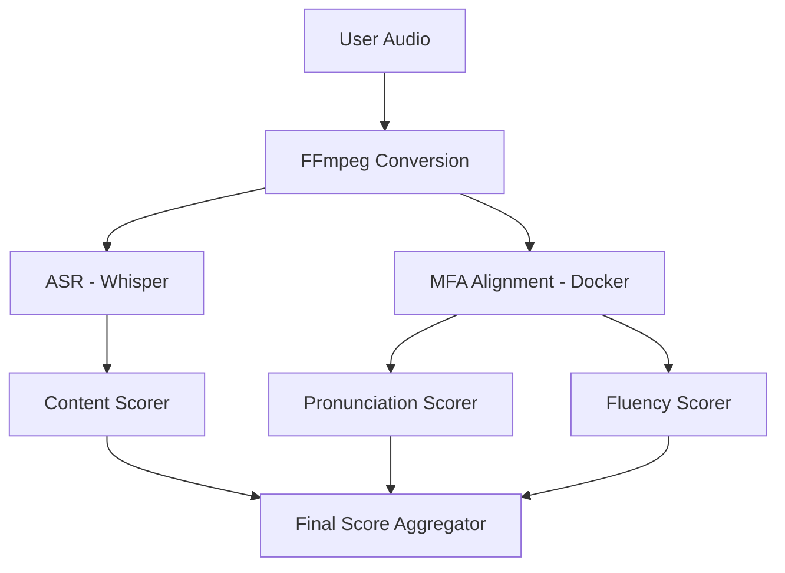

# Read Aloud Architecture

## 1. Overview

The **Read Aloud** task evaluates a student's ability to read a provided text passage clearly and fluently.

- **Input**: Audio recording + Reference Text
- **Output**: 0-90 Score (Content, Pronunciation, Fluency)

---

## 2. Technical Workflow

---

## 3. Component Breakdown

### A. Content Scoring (33.3%)

* **Goal**: Check if the student said the words in the text.
- **Tech**: `difflib` Sequence Matching.
- **Logic**:
    1. Compare ASR transcript with Reference.
    2. Identify: Correct, Omitted (skipped), Inserted (extra words), Substituted (wrong word).
    3. Penalty applied for skips and extra words.

### B. Pronunciation Scoring (33.3%)

* **Goal**: Evaluate how accurately phonemes and stress were produced.
- **Tech**: MFA (Montreal Forced Aligner) + `AccentTolerantScorer`.
- **Logic**:
    1. **Phonemes**: Compares observed phonemes (from MFA) against CMUDict dictionary.
    2. **Stress**: Analyzes energy/pitch peaks on vowels to check for correct syllable stress.
    3. **Accent Tolerance**: Allows for variations based on chosen accent (Indian, US, UK, etc.).

### C. Fluency Scoring (33.3%)

* **Goal**: Evaluate the rhythm and "flow" of speech.
- **Tech**: Signal Analysis + Pause Clustering.
- **Logic**:
    1. **Speech Rate**: Words per second compared to a "fluent" baseline.
    2. **Hesitations**: Clusters small silences to detect "false starts" or heavy stuttering.
    3. **Pauses**: Measures length of silences at punctuation marks vs. mid-sentence breaks.

---

## 4. Infrastructure (The "Glue")

* **Main App (Host)**: Runs Flask and Whisper (ASR).
- **Docker Container**: Runs MFA (Montreal Forced Aligner) because it requires complex dependencies (Kaldi/C++) that are kept isolated for stability.
- **Communication**: Host prepares audio/text files $\rightarrow$ Docker mounts volumes $\rightarrow$ Docker processes $\rightarrow$ Host reads output TextGrid.
