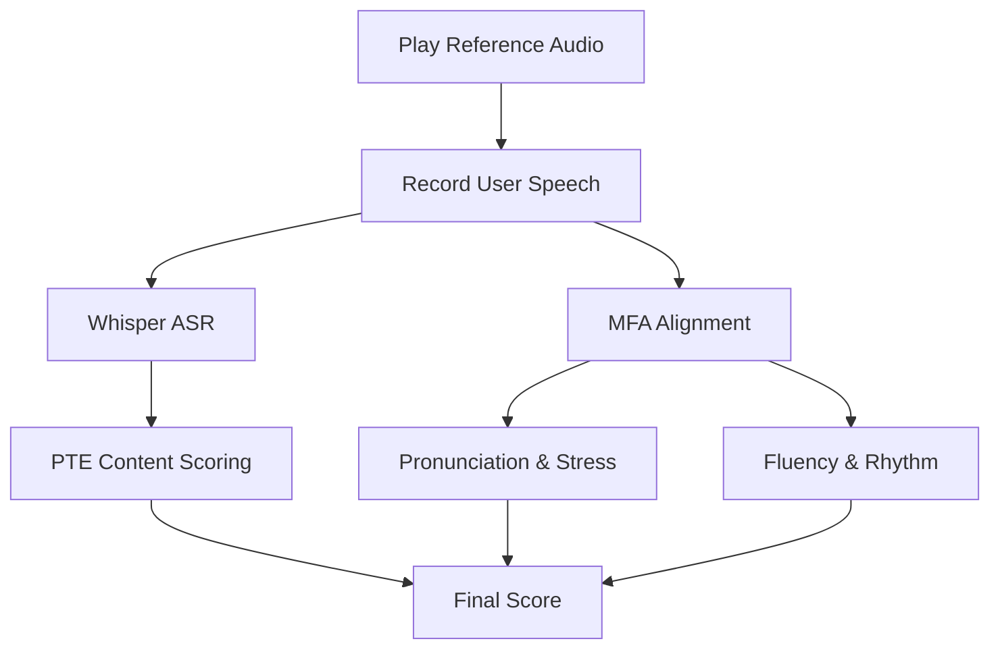

# Repeat Sentence Architecture

## 1. Overview

The **Repeat Sentence** task tests both listening comprehension and speaking clarity. The student listens to a sentence and must repeat it exactly.

- **Input**: Audio recording + Playback Reference
- **Output**: 0-90 Score (Content, Pronunciation, Fluency)

---

## 2. Technical Workflow

Repeat Sentence shares the same core engine as **Read Aloud**, with the main difference being the source of the reference text (it is the transcript of the audio played to the user).

---

## 3. Component Breakdown

### A. Content Scoring (Max 3 Points per PTE)

* **Goal**: Precise accuracy of the repeated sequence.
- **Logic**:
  - **3 Points**: 100% of words in correct sequence.
  - **2 Points**: At least 50% of words in correct sequence.
  - **1 Point**: Less than 50% of words but some keywords captured.
  - **0 Points**: No match or off-topic.

### B. Pronunciation & Fluency

* **Logic**: Identical to **Read Aloud**.
- **Phonemes**: Scored at the phoneme level using MFA alignment.
- **Rhythm**: Measures the interval between words to ensure the student isn't "robotically" repeating but using natural English stress.

---

## 4. Key Differences from Read Aloud

While the backend engine (`validator.py`) is the same, the user experience differs:

1. **Memory Constraint**: No text is shown on screen; the student relies on memory.
2. **Short Duration**: Sentences are typically 3-9 seconds long, requiring extremely fast processing.
3. **No Preparation**: Unlike Read Aloud, there is no "preparation time" countdown.

---

## 5. Technology Stack

* **Phoneme Mapping**: G2P (Grapheme-to-Phoneme) conversion via CMUDict.
- **Alignment Engine**: MFA (Montreal Forced Aligner) running in Docker.
- **Scoring Weights**: `AccentTolerantScorer` ensures fair grading for non-native speakers.
