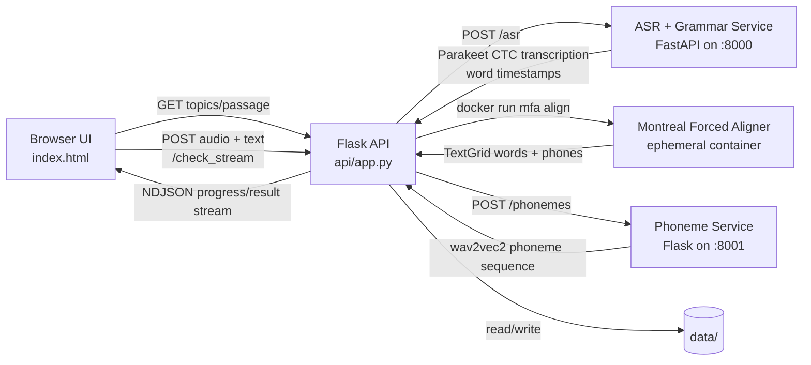

# Read Aloud Architecture (Current Implementation)

Last verified against repository code: March 22, 2026

## 1. Scope and source of truth

This document describes the Read Aloud pipeline that is currently used by the web app.

Primary runtime path:

- UI page: `api/templates/index.html`
- Prompt APIs: `/speaking/read-aloud/get-topics`, `/speaking/read-aloud/get-passage`
- Submission API: `/check_stream`
- Main orchestration engine: `api/validator.py`

Important distinction:

- `read_aloud/pte_pipeline.py` and the `read_aloud/explanation/` files describe an earlier or exploratory pronunciation pipeline.
- The live browser flow does not call that module directly.
- The production path for Read Aloud in this repo is the Flask route in `api/app.py` plus the generator pipeline in `api/validator.py`.

## 2. Runtime topology



Service roles:

- `api` on port `5000`: user-facing Flask app and orchestration layer.
- `asr-grammar` on port `8000`: FastAPI service hosting `nvidia/parakeet-ctc-0.6b` ASR and `LanguageTool`.
- `wav2vec2-service` on port `8001`: Flask microservice hosting `facebook/wav2vec2-lv-60-espeak-cv-ft` for phoneme inference.
- MFA runner: transient Docker container using `mmcauliffe/montreal-forced-aligner:latest`.

## 3. Entry points and UI behavior

### 3.1 Page and prompt loading

The Read Aloud page is served by:

- `GET /speaking/read-aloud` -> `api/templates/index.html`

Prompt metadata is loaded from:

- `GET /speaking/read-aloud/get-topics`
- `GET /speaking/read-aloud/get-passage`

Prompt source:

- `READ_ALOUD_REFERENCE_FILE` from `src/shared/paths.py`
- resolved in `api/app.py` as `READ_ALOUD_JSON`
- canonical target: `data/reference/read_aloud/references.json`
- legacy fallback: `data_2/read_aloud_references.json`

### 3.2 Audio acquisition

The browser supports two acquisition modes:

- `MediaRecorder` microphone capture
- manual audio upload

Client-side behavior in `api/templates/index.html`:

- selected accent is persisted in `localStorage`
- audio is posted as multipart form data
- request body contains `audio`, `text`, `feature=read_aloud`, and `accent`
- the client reads an `application/x-ndjson` response stream and updates a progress bar incrementally

### 3.3 Response rendering

The UI consumes:

- `progress` events for percent and status text
- `result` events for final scoring payload
- `error` events for recoverable failure messages

Word-level rendering and modal inspection are implemented in:

- `api/static/js/word_level_feedback.js`

That script adds:

- synthetic gap markers for excessive inter-word silence
- pause-range formatting
- stress issue highlighting
- per-token modal inspection
- word-practice rechecks using `/api/word-practice`

## 4. End-to-end request flow

### 4.1 Upload normalization

`POST /check_stream` in `api/app.py` performs:

1. save uploaded media to a temporary file in `data/user_uploads/...`
2. convert media to `16 kHz`, `mono`, `WAV` using `ffmpeg`
3. persist the reference text into a sibling `.txt` file
4. invoke `align_and_validate_gen(audio_path, text_path, accents=[accent])`
5. stream generator output back to the browser as NDJSON

Audio normalization utility:

- `convert_to_wav()` in `api/app.py`

Attempt path generation:

- `api/file_utils.py`
- runtime files are created under `USER_UPLOADS_DIR`

### 4.2 Cache lookup

Before expensive processing, `api/validator.py` optionally checks the Read Aloud result cache.

Cache characteristics:

- directory: `data/processed/mfa_runs/result_cache/read_aloud`
- key dimensions:
  - audio SHA-256
  - raw reference text
  - requested accent list
  - MFA Docker image
  - dictionary/model file signatures
  - cache schema version
  - pipeline version
- controls:
  - `PTE_READ_ALOUD_CACHE_ENABLED`
  - `PTE_READ_ALOUD_CACHE_MAX_AGE_SECONDS`

If there is a hit, the generator returns early with `summary.cached = true`.

### 4.3 ASR transcription and coarse content alignment

The first active analysis stage is ASR:

- `pte_core.asr.voice2text.voice2text()`
- POSTs audio to `ASR_SERVICE_URL`
- default URL: `http://localhost:8000/asr` or the Compose-internal equivalent

The ASR microservice:

- lives in `docker/asr-grammar/app.py`
- loads NeMo `nvidia/parakeet-ctc-0.6b`
- emits:
  - transcript text
  - word-level timestamps derived from `word_offsets`

The API reformats those timestamps to the internal schema:

```json
{
  "value": "word",
  "start": 0.0,
  "end": 0.0
}
```

Content matching is then performed by `compare_text()` in `api/validator.py`.

Technical details:

- reference text is tokenized with pause punctuation preservation
- ASR text is tokenized without punctuation assumptions
- `difflib.SequenceMatcher` computes the coarse token alignment
- output statuses:
  - `correct`
  - `omitted`
  - `inserted`

This stage is lexical alignment, not phonetic alignment.

### 4.4 Speech-rate normalization

`calculate_speech_rate_scale()` in `pte_core/pause/speech_rate.py` derives a normalization factor from ASR word timing.

This scale is used later to adapt:

- expected punctuation pause windows
- extra gap interpretation

If MFA word timings are available later, the engine recalculates `speech_rate_scale` from MFA words and prefers that value.

### 4.5 MFA forced alignment

The pronunciation anchor is Montreal Forced Aligner.

Execution model:

- implemented in `run_single_alignment_gen()` in `api/validator.py`
- shells out to Docker instead of importing MFA directly into the Flask process
- default mode: `docker run --rm`
- optional persistent mode: `docker exec` when `PTE_MFA_CONTAINER_NAME` is set

MFA command shape:

```text
mfa align /runtime/<run_id>/input /models/<dict> /models/<acoustic_model> /runtime/<run_id>/output/<accent> --clean --quiet --beam 100 --retry_beam 400 --num_jobs <n>
```

Runtime mounts:

- host MFA model directory -> `/models`
- host MFA runtime directory -> `/runtime`

Path resolution sources:

- `PTE_MFA_DOCKER_MOUNT_BASE_DIR`
- `PTE_MFA_DOCKER_MOUNT_RUNTIME_DIR`
- `PTE_HOST_PROJECT_ROOT`

Accent configuration currently wired in `ACCENTS_CONFIG`:

- `Indian`
- `US_ARPA`
- `US_MFA`
- `UK`
- `Nigerian`
- `NonNative`

Each accent maps to:

- pronunciation dictionary path
- acoustic model archive path

Output artifact:

- `input.TextGrid`

The generator emits heartbeat progress while MFA is running so the browser connection does not appear stalled.

### 4.6 TextGrid parsing

Once alignment completes, `api/validator.py` parses the MFA output using a custom parser:

- `parse_textgrid()`
- `read_textgrid_words()`
- `read_textgrid_phones()`

The parser extracts intervals from:

- `words` tier
- `phones` tier

Each interval is normalized into a dict containing:

- `start`
- `end`
- `value`
- aliases such as `word` or `label`

The engine also derives:

- `mfa_word_gaps`: positive gaps between adjacent MFA words
- `ref_to_mfa_map`: occurrence-aware mapping from reference tokens to MFA words

The occurrence-aware mapping is important for repeated tokens, because a naive lexical lookup would incorrectly bind every repeated word to the first occurrence.

### 4.7 Word-level pronunciation analysis

The main per-word logic lives in:

- `analyze_word_pronunciation()` in `api/validator.py`

This stage only performs deep pronunciation analysis for:

- aligned words
- inserted words
- any token with a usable transcription index

#### Expected phoneme generation

Expected pronunciations are generated by:

- `pte_core.phoneme.g2p.PhonemeReferenceBuilder`

Backends:

- CMUdict first
- `g2p_en` fallback

The builder also exposes lexical stress patterns.

#### Observed phoneme generation

Observed phonemes are sourced in this priority order:

1. MFA phone intervals inside the word time window
2. `wav2vec2-service` fallback via `call_phoneme_service()`

The phoneme service:

- posts audio plus optional `start`/`end` bounds to `/phonemes`
- slices the waveform to the requested segment
- decodes phoneme tokens with `facebook/wav2vec2-lv-60-espeak-cv-ft`

#### Accent-tolerant scoring

The live word scorer is:

- `pte_core.scoring.accent_scorer.AccentTolerantScorer`

This scorer performs:

- ARPAbet-to-IPA normalization
- accent substitution tolerance
- articulatory feature distance scoring using `panphon`
- penalty shaping for insertions, deletions, and critical substitutions

Supported accent labels inside the scorer include:

- `Indian English`
- `Nigerian English`
- `United Kingdom`
- `Non-Native English`

The validator maps UI-facing accent codes to these scoring labels.

Per-word fields that may be emitted:

- `expected_phones`
- `observed_phones`
- `phoneme_analysis`
- `accuracy_score`
- `per`
- `combined_score`
- `start`
- `end`

Status rewrite rule:

- if `combined_score < 0.55`, the token is downgraded to `mispronounced`

### 4.8 Stress analysis

Stress analysis is separate from phone matching.

Implementation:

- `pte_core.scoring.stress.get_syllable_stress_details()`

Inputs:

- audio segment boundaries
- MFA phone intervals with timing
- reference lexical stress pattern from CMUdict or `g2p_en`

Derived fields:

- `stress_score`
- `stress_details`
- `stress_error`
- `stress_level`
- `stress_feedback`
- `mfa_timings`

Combined-score formula in the current validator:

```text
combined_score = (0.7 * accuracy_score + 0.3 * stress_score * 100) / 100
```

This is a local heuristic for practice feedback, not an official Pearson score.

### 4.9 Pause and hesitation analysis

Pause analysis is punctuation-driven, not silence-driven across all token boundaries.

Reference punctuation is preserved during tokenization for:

- `,`
- `.`
- and other pause punctuation defined in `read_aloud.alignment.normalizer`

Pause evaluation is handled by:

- `pte_core.pause.pause_evaluator.evaluate_pause()`

Inputs:

- punctuation token
- measured pause duration from MFA or ASR boundaries
- speech-rate scale
- previous word context

Pause statuses:

- `correct_pause`
- `short_pause`
- `long_pause`
- `missed_pause`

Penalty behaviors:

- comma and full stop use different expected ranges
- ranges are multiplied by `speech_rate_scale`
- function-word contexts reduce penalties
- repeated-word contexts can amplify penalties

After individual pause scoring, the engine applies hesitation clustering:

- `pte_core.pause.hesitation.apply_hesitation_clustering()`

This amplifies multiple nearby pause penalties inside a small time window.

The final aggregated fluency-side penalty is computed by:

- `aggregate_pause_penalty()`

### 4.10 Final payload assembly

The final result emitted by `align_and_validate_gen()` contains:

- `words`
- `transcript`
- `pauses`
- `mfa_word_gaps`
- `speech_rate_scale`
- `raw_word_timestamps`
- `meta`
- `summary`
- `word_feedback`

`word_feedback` is generated by `build_word_level_feedback()` and provides a compact UI summary of:

- mispronunciations
- insertions
- omissions
- stress issues

The browser then adds additional display-only gap markers through `word_level_feedback.js`.

## 5. Data model and statuses

### 5.1 Word record semantics

A word entry in `words[]` can represent:

- a lexical token from the reference
- an inserted spoken token
- a punctuation token with pause metadata

Common status values:

- `correct`
- `mispronounced`
- `inserted`
- `omitted`
- `correct_pause`
- `short_pause`
- `long_pause`
- `missed_pause`

### 5.2 Summary semantics

The current summary is implementation-specific:

- `total`
- `correct`
- `mispronounced`
- `inserted`
- `omitted`
- `stress_issues`
- `pause_penalty`
- `pause_count`
- `cached`

This is not yet a calibrated exam-style `10-90` or `0-90` score.

The UI currently behaves like an explainable practice analyzer rather than a fully normalized exam simulator.

## 6. Runtime filesystem layout

Primary runtime roots from `src/shared/paths.py`:

- `data/user_uploads`
- `data/models/mfa`
- `data/processed/mfa_runs`
- `data/reference`

Per-attempt artifacts:

- uploaded/converted WAV
- paired TXT reference
- MFA run directory under `data/processed/mfa_runs/<run_id>/`
- output `TextGrid`
- optional cached result JSON

The API also persists selected result artifacts for debugging and traceability.

## 7. Fallback and degradation behavior

### 7.1 ASR fallback

If the ASR service fails, `pte_core.asr.voice2text()` falls back to pseudo timestamp generators from `pseudo_voice2text.py`.

This keeps the application responsive but reduces result fidelity.

### 7.2 MFA disabled or unavailable

When:

- `PTE_SKIP_MFA=1`, or
- Docker is not ready for the built-in runner

the validator returns an ASR-only payload via `build_asr_only_result()`.

In this mode:

- phoneme-level analysis is skipped
- pause list is empty
- summary contains `asr_only = true`
- a note explains why MFA was bypassed

### 7.3 MFA alignment failure

If all requested MFA accents fail:

- the API falls back to the ASR-only result
- stderr is persisted to `mfa_stderr.log` where possible
- the result includes a note explaining that phoneme-level analysis is unavailable

### 7.4 Per-word phoneme fallback

If MFA does not yield phones for a word:

- the engine queries the phoneme microservice for the word segment

If even that fails:

- the word receives a neutral fallback pronunciation score instead of crashing the request

## 8. Currently active vs legacy modules

Currently active for browser Read Aloud:

- `api/app.py`
- `api/validator.py`
- `api/templates/index.html`
- `api/static/js/word_level_feedback.js`
- `pte_core/asr/voice2text.py`
- `pte_core/asr/phoneme_recognition.py`
- `pte_core/phoneme/g2p.py`
- `pte_core/scoring/accent_scorer.py`
- `pte_core/scoring/stress.py`
- `pte_core/pause/*`
- `src/shared/paths.py`
- `src/shared/services.py`

Supporting infrastructure:

- `docker/asr-grammar/app.py`
- `docker/phoneme-service/app.py`
- `docker/phoneme-service/phoneme_model.py`
- `docker-compose.yml`

Not the primary live path for `/check_stream`:

- `read_aloud/pte_pipeline.py`
- `read_aloud/report_generator.py`
- `read_aloud/wavlm_pronunciation.py`
- `read_aloud/explanation/*.md`

These files are still useful as design background, but they are not the main request path used by the current web page.

## 9. Operational controls

Important environment variables for the current implementation:

- `PTE_ASR_GRAMMAR_BASE_URL`
- `PTE_PHONEME_BASE_URL`
- `PTE_DATA_ROOT`
- `PTE_USER_UPLOADS_DIR`
- `PTE_MFA_BASE_DIR`
- `PTE_MFA_RUNTIME_DIR`
- `PTE_HOST_PROJECT_ROOT`
- `PTE_MFA_DOCKER_MOUNT_BASE_DIR`
- `PTE_MFA_DOCKER_MOUNT_RUNTIME_DIR`
- `PTE_SKIP_MFA`
- `PTE_MFA_NUM_JOBS`
- `PTE_WORD_ANALYSIS_WORKERS`
- `PTE_WORD_ANALYSIS_TIMEOUT_SECONDS`
- `PTE_READ_ALOUD_CACHE_ENABLED`
- `PTE_READ_ALOUD_CACHE_MAX_AGE_SECONDS`
- `PTE_MFA_CONTAINER_NAME`

## 10. Current architectural limitations

1. Content alignment is based on `difflib.SequenceMatcher`, so it is lexical and order-sensitive rather than ASR-lattice-aware.
2. Word timestamps from Parakeet are derived heuristically from frame offsets and may not perfectly match acoustic boundaries.
3. The final summary is not calibrated to Pearson scoring bands.
4. The phoneme service is CPU-only and can become a bottleneck if many per-word fallbacks are needed.
5. MFA is executed as an external Docker process, so cold starts and model I/O can dominate latency.
6. Pause scoring is punctuation-anchored; it does not model all fluency phenomena such as repairs, discourse markers, or prosodic phrasing.
7. The UI renders additional synthetic gap markers that are display-layer constructs, not original backend tokens.

## 11. Practical interpretation

The current Read Aloud architecture is best understood as a hybrid explainable scoring pipeline:

- ASR provides transcript and coarse temporal anchors.
- MFA provides forced word and phone alignment when infrastructure is available.
- a phoneme microservice provides segment-level recovery when MFA phone evidence is sparse.
- accent-tolerant phone scoring and lexical stress analysis produce word-level pronunciation judgments.
- punctuation-aware pause analysis adds a fluency penalty dimension.

This makes the feature operationally useful for practice and feedback, but it is still a heuristic practice engine rather than a fully psychometrically calibrated PTE scoring system.
